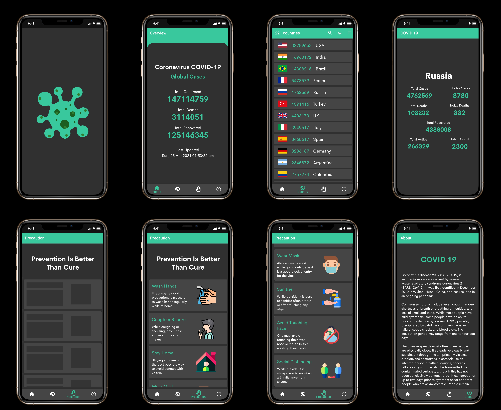

# Covid Tracker
**Covid Tracker** is an Android app which helps its user keep track of the COVID-19 cases all around the globe.

## Screenshots

## How is the app built?
This app is built natively using Android Studio with Java.

## Features
* See the World wide cases and some other details in the Home page
* A list of COVID-19 cases country wise is available
* Use the search bar to search for a specific country
* Sort the cases by the name of the country and the number of cases
* Click on any country for further information regarding COVID-19
* See the precautions to be taken

## Components used
* **Navigation** - For simplified navigation through fragments

## Other libraries/services used
* **Shimmer** - For showing the shimmer effect while loading a page
* **Glide & Volley** - For loading images into ImageView
* **Gson** - For converting JSON to POJO and vice versa
* **Lottie** - For loading animations from lottiefiles.com
* **disease.sh API** - For getting the data

## Developer and Designer
* **Dinesh B S** [(@DineshBS44)](https://github.com/DineshBS44)

## License
Licensed under MIT License :  https://opensource.org/licenses/MIT

 
 
